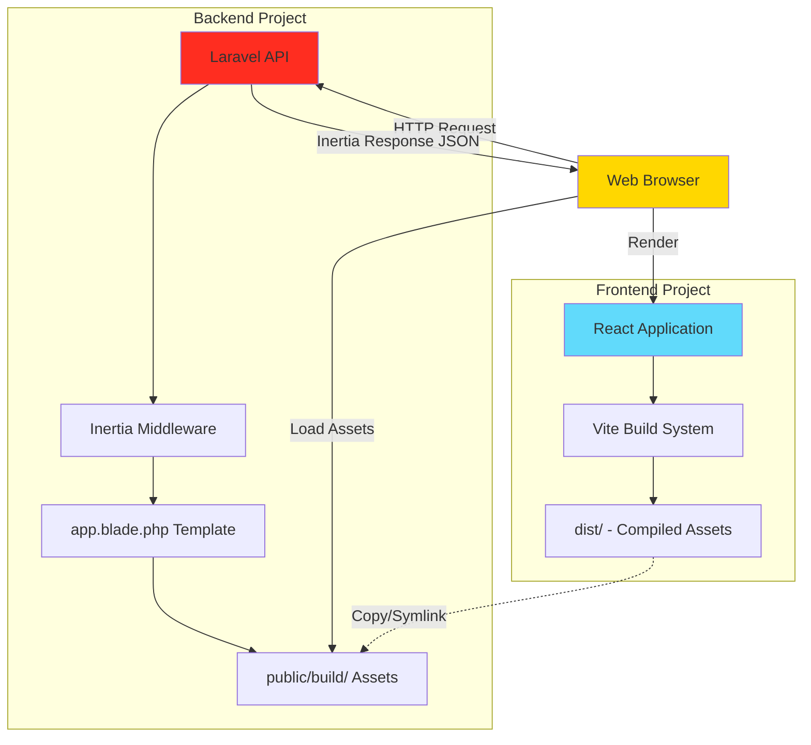
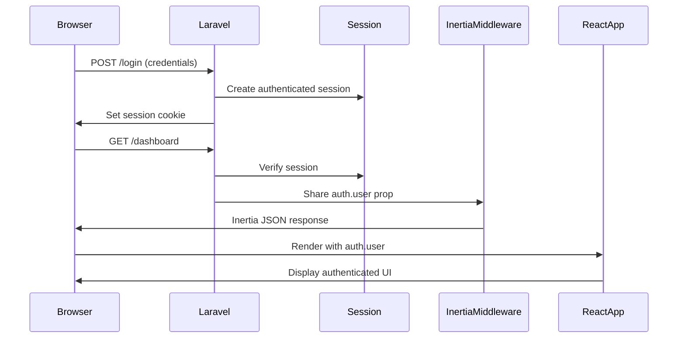

# Design Document: Backend-Frontend Separation

## Overview

This design addresses the separation of a monolithic Laravel + Inertia.js + React application into two independent projects: a **Backend API** (Laravel) and a **Frontend Application** (React). The goal is to decouple the architecture while maintaining seamless communication through Inertia.js, enabling independent development, deployment, and scaling of each layer.

### Current Architecture

The existing application follows the standard Laravel + Inertia.js + React Breeze structure:
- **Monolithic structure**: All code (PHP backend + React frontend) resides in a single Laravel project
- **Vite integration**: Laravel Vite plugin compiles React assets within the Laravel project
- **Inertia.js**: Provides SSR-like experience by rendering React components with server-side data
- **Authentication**: Laravel Breeze with React provides login, registration, and profile management

### Target Architecture

The separated architecture will consist of:

```
project-root/
├── backend/          # Laravel API project
│   ├── app/          # Controllers, Models, Middleware
│   ├── config/       # Laravel configuration
│   ├── database/     # Migrations, Seeders, Factories
│   ├── routes/       # API routes
│   ├── public/       # Entry point + compiled assets (symlink or copy)
│   └── storage/      # Logs, cache, sessions
│
└── frontend/         # React standalone project
    ├── src/          # React components, pages, layouts
    ├── public/       # Static assets
    ├── dist/         # Compiled output (generated by Vite)
    └── vite.config.js
```

### Key Design Decisions

1. **Hybrid Architecture**: Frontend in separate folder but uses `laravel-vite-plugin` for Laravel compatibility
2. **Physical Separation**: Two distinct project directories with independent dependency management
3. **Laravel Integration**: Keep `laravel-vite-plugin` to maintain compatibility with Laravel's `@vite()` directive
4. **Asset Compilation**: Frontend builds independently; backend serves compiled assets via plugin
5. **Inertia Communication**: Backend sends JSON responses with page props; frontend renders React components
6. **Development Workflow**: Two concurrent dev servers (Laravel serve + Vite HMR)
7. **Production Deployment**: Frontend builds to `dist/`, backend reads manifest via `laravel-vite-plugin`

### Why Hybrid Architecture?

**The Problem with Full Separation**:
The initial design attempted to remove `laravel-vite-plugin` entirely, but this creates a critical incompatibility:
- Laravel's `@vite()` directive is built to work with `laravel-vite-plugin`
- The directive expects the plugin to handle dev server detection, manifest reading, and asset path resolution
- Removing the plugin would require reimplementing all this functionality manually

**The Hybrid Solution**:
Instead of fighting Laravel's architecture, we embrace it while achieving our separation goals:
- **Frontend lives in separate folder** (`frontend/` instead of `resources/js/`)
- **Frontend keeps `laravel-vite-plugin`** for Laravel compatibility
- **Plugin configured to work with separated structure** via `input` and `buildDirectory` options
- **Laravel naturally communicates with Vite** through the plugin's built-in mechanisms
- **Simpler, more maintainable, follows Laravel conventions**

**Benefits**:
- ✅ Physical separation of concerns (backend/ and frontend/ folders)
- ✅ Independent frontend development and testing
- ✅ No manual manifest parsing or asset path resolution
- ✅ Automatic dev server detection via `hot` file
- ✅ Standard Laravel workflow, easier for team onboarding
- ✅ Future-proof: updates to Laravel Vite integration work automatically

---

## Architecture

### High-Level Component Diagram



### Request Flow

#### Development Mode
1. Browser requests page from Laravel backend (e.g., `http://localhost:8000/dashboard`)
2. Laravel controller returns Inertia response with page component name and props
3. Inertia middleware injects `app.blade.php` template with Vite dev server URLs
4. Browser loads React app from Vite dev server (`http://localhost:5173`)
5. React app receives Inertia props and renders the requested page component
6. HMR updates are pushed from Vite dev server to browser

#### Production Mode
1. Frontend project runs `npm run build` → generates `dist/` with hashed assets
2. Compiled assets are copied/symlinked to backend's `public/build/` directory
3. Browser requests page from Laravel backend
4. Laravel reads `manifest.json` to resolve asset paths
5. `app.blade.php` includes compiled JS/CSS with cache-busting hashes
6. Browser loads and executes React application

### Authentication Flow



---

## Components and Interfaces

### Backend Components

#### 1. Inertia Middleware (`HandleInertiaRequests`)

**Responsibility**: Share global data with frontend, configure root view

**Interface**:
```php
class HandleInertiaRequests extends Middleware
{
    protected $rootView = 'app';
    
    public function share(Request $request): array
    {
        return [
            'auth' => ['user' => $request->user()],
            'flash' => ['message' => session('message')],
            'errors' => session('errors'),
        ];
    }
}
```

**Configuration Changes**:
- `$rootView` points to `resources/views/app.blade.php`
- Shared props include authentication state, flash messages, validation errors

#### 2. Root Blade Template (`resources/views/app.blade.php`)

**Responsibility**: HTML shell that loads React application

**Interface**:
```blade
<!DOCTYPE html>
<html lang="{{ str_replace('_', '-', app()->getLocale()) }}">
<head>
    <meta charset="utf-8">
    <meta name="viewport" content="width=device-width, initial-scale=1">
    <title inertia>{{ config('app.name', 'Laravel') }}</title>
    
    {{-- Laravel Vite plugin handles dev vs production automatically --}}
    @vite(['../frontend/src/app.jsx'])
    
    @inertiaHead
</head>
<body>
    @inertia
</body>
</html>
```

**Key Features**:
- **Simplified loading**: `@vite()` directive handles dev vs production automatically
- **Path to frontend**: Points to `../frontend/src/app.jsx` (relative to backend)
- **No conditional logic needed**: `laravel-vite-plugin` manages environment detection
- **`@inertia`**: Renders the root div with initial page data
- **`@inertiaHead`**: Injects page-specific head elements

#### 3. Laravel Vite Configuration

**Responsibility**: Configure Laravel to find frontend files in separated structure

**Implementation**: The `laravel-vite-plugin` in `frontend/vite.config.js` handles communication with Laravel automatically. Laravel needs to know where to find the frontend build output.

**Configuration** (`config/vite.php` - Laravel 11+ built-in):
```php
return [
    /*
     | Build directory for compiled assets
     | This should match the buildDirectory in frontend/vite.config.js
     */
    'build_directory' => env('VITE_BUILD_DIRECTORY', '../frontend/dist'),
    
    /*
     | Hot file path for development mode detection
     | Laravel checks this file to determine if Vite dev server is running
     */
    'hot_file' => public_path('../frontend/dist/hot'),
];
```

**How It Works**:
1. **Development Mode**: 
   - Frontend runs `npm run dev`
   - `laravel-vite-plugin` creates a `hot` file in `frontend/dist/`
   - Laravel detects this file and loads assets from Vite dev server
   - Plugin automatically configures correct URLs

2. **Production Mode**:
   - Frontend runs `npm run build`
   - Assets compiled to `frontend/dist/` with manifest
   - Laravel reads manifest from `frontend/dist/manifest.json`
   - `@vite()` directive resolves hashed asset paths

#### 4. CORS Configuration

**Responsibility**: Allow cross-origin requests from frontend dev server

**Configuration** (`config/cors.php`):
```php
return [
    'paths' => ['api/*', 'sanctum/csrf-cookie', 'login', 'logout', 'register'],
    'allowed_origins' => [env('FRONTEND_URL', 'http://localhost:5173')],
    'allowed_methods' => ['*'],
    'allowed_headers' => ['*'],
    'exposed_headers' => [],
    'max_age' => 0,
    'supports_credentials' => true,
];
```

#### 5. Session Configuration

**Responsibility**: Enable cross-domain session cookies

**Configuration** (`config/session.php`):
```php
'domain' => env('SESSION_DOMAIN', null),
'same_site' => env('SESSION_SAME_SITE', 'lax'),
'secure' => env('SESSION_SECURE_COOKIE', false),
'http_only' => true,
```

**Sanctum Configuration** (`config/sanctum.php`):
```php
'stateful' => explode(',', env('SANCTUM_STATEFUL_DOMAINS', 'localhost,localhost:5173,127.0.0.1,127.0.0.1:5173')),
```

### Frontend Components

#### 1. Vite Configuration (`vite.config.js`)

**Responsibility**: Build React application for separated architecture while maintaining Laravel compatibility

**Configuration**:
```javascript
import { defineConfig } from 'vite';
import laravel from 'laravel-vite-plugin';
import react from '@vitejs/plugin-react';
import path from 'path';

export default defineConfig({
    plugins: [
        laravel({
            input: ['src/app.jsx'],
            buildDirectory: 'dist',
            refresh: true,
        }),
        react(),
    ],
    
    server: {
        port: 5173,
        strictPort: true,
        cors: true,
        origin: 'http://localhost:5173',
    },
    
    resolve: {
        alias: {
            '@': path.resolve(__dirname, './src'),
        },
    },
});
```

**Key Configuration Details**:
- **Keep `laravel-vite-plugin`**: Required for Laravel's `@vite()` directive to work
- **`input`**: Points to frontend entry file in separated structure (`src/app.jsx`)
- **`buildDirectory`**: Output to `dist/` instead of default `build/`
- **`refresh`**: Enable hot reload for development
- **Plugin communicates with Laravel**: Vite dev server and Laravel backend coordinate automatically

#### 2. Inertia App Initialization (`src/app.jsx`)

**Responsibility**: Bootstrap Inertia React application

**Configuration**:
```javascript
import { createInertiaApp } from '@inertiajs/react';
import { createRoot } from 'react-dom/client';

const appName = import.meta.env.VITE_APP_NAME || 'Laravel';

createInertiaApp({
    title: (title) => `${title} - ${appName}`,
    
    resolve: (name) => {
        // Dynamic import of page components
        const pages = import.meta.glob('./Pages/**/*.jsx', { eager: false });
        return pages[`./Pages/${name}.jsx`]();
    },
    
    setup({ el, App, props }) {
        const root = createRoot(el);
        root.render(<App {...props} />);
    },
    
    progress: {
        color: '#4B5563',
    },
});
```

**Key Changes**:
- Replace `resolvePageComponent` helper with direct `import.meta.glob`
- Remove dependency on `laravel-vite-plugin/inertia-helpers`
- Maintain dynamic page component loading

#### 3. API Client Configuration

**Responsibility**: Configure Axios for backend API requests

**Implementation** (`src/bootstrap.js`):
```javascript
import axios from 'axios';

axios.defaults.baseURL = import.meta.env.VITE_API_URL || 'http://localhost:8000';
axios.defaults.withCredentials = true;
axios.defaults.headers.common['X-Requested-With'] = 'XMLHttpRequest';
axios.defaults.headers.common['Accept'] = 'application/json';

window.axios = axios;
```

---

## Data Models

### Asset Manifest Structure

The Vite build process generates a `manifest.json` file that maps source files to compiled output files:

```json
{
  "src/app.jsx": {
    "file": "assets/app-a1b2c3d4.js",
    "src": "src/app.jsx",
    "isEntry": true,
    "css": ["assets/app-e5f6g7h8.css"],
    "imports": ["_vendor-i9j0k1l2.js"]
  },
  "_vendor-i9j0k1l2.js": {
    "file": "assets/vendor-i9j0k1l2.js"
  }
}
```

**Fields**:
- `file`: Compiled output filename with content hash
- `src`: Original source file path
- `isEntry`: Whether this is an entry point
- `css`: Associated CSS files
- `imports`: Chunk dependencies

### Inertia Page Response

Backend sends JSON responses with this structure:

```json
{
  "component": "Dashboard",
  "props": {
    "auth": {
      "user": {
        "id": 1,
        "name": "John Doe",
        "email": "john@example.com"
      }
    },
    "flash": {
      "message": null
    },
    "errors": {}
  },
  "url": "/dashboard",
  "version": "1.0"
}
```

### Environment Variables

#### Backend (`.env`)
```env
# Application
APP_URL=http://localhost:8000

# Frontend
FRONTEND_URL=http://localhost:5173

# Vite Build Directory (relative to backend)
VITE_BUILD_DIRECTORY=../frontend/dist

# Session
SESSION_DOMAIN=localhost
SESSION_SAME_SITE=lax
SESSION_SECURE_COOKIE=false

# Sanctum
SANCTUM_STATEFUL_DOMAINS=localhost:5173,localhost:8000
```

#### Frontend (`.env`)
```env
# API
VITE_API_URL=http://localhost:8000

# Application
VITE_APP_NAME=Laravel
```

---

## Error Handling

### Development Mode Errors

#### 1. Vite Dev Server Not Running

**Symptom**: Browser shows "Failed to load resource: net::ERR_CONNECTION_REFUSED" for `http://localhost:5173`

**Detection**: Laravel checks for `frontend/dist/hot` file to detect dev server

**Handling**:
- Ensure frontend dev server is running: `cd frontend && npm run dev`
- Verify `laravel-vite-plugin` is installed in frontend
- Check that Vite dev server is on port 5173
- Laravel will automatically fall back to production assets if dev server is not detected

#### 2. CORS Errors

**Symptom**: Browser console shows "CORS policy: No 'Access-Control-Allow-Origin' header"

**Detection**: Browser network tab shows failed preflight requests

**Handling**:
- Verify `FRONTEND_URL` in backend `.env` matches frontend dev server
- Check `config/cors.php` includes frontend URL in `allowed_origins`
- Ensure `supports_credentials` is `true`

#### 3. Session Cookie Not Set

**Symptom**: Authentication fails, `auth.user` is always null

**Detection**: Browser dev tools → Application → Cookies shows no Laravel session cookie

**Handling**:
- Verify `SESSION_DOMAIN` is set correctly (use `null` for localhost)
- Check `SANCTUM_STATEFUL_DOMAINS` includes frontend domain
- Ensure `axios.defaults.withCredentials = true` in frontend

### Production Mode Errors

#### 1. Missing Manifest File

**Symptom**: Laravel throws exception "Vite manifest not found"

**Detection**: Check if `frontend/dist/manifest.json` exists

**Handling**:
- Run frontend build: `cd frontend && npm run build`
- Verify `buildDirectory: 'dist'` is set in `frontend/vite.config.js`
- Check `VITE_BUILD_DIRECTORY` in backend `.env` points to `../frontend/dist`
- Ensure `laravel-vite-plugin` is properly configured in frontend

#### 2. Asset 404 Errors

**Symptom**: Browser shows 404 for asset files

**Detection**: Browser network tab shows failed asset requests

**Handling**:
- Verify `buildDirectory: 'dist'` in `frontend/vite.config.js`
- Check `VITE_BUILD_DIRECTORY=../frontend/dist` in backend `.env`
- Ensure frontend build completed successfully
- Verify `laravel-vite-plugin` configuration matches Laravel's expectations
- The plugin handles asset path resolution automatically

#### 3. Inertia Version Mismatch

**Symptom**: Page reloads on every navigation, no SPA behavior

**Detection**: Inertia version header mismatch in network requests

**Handling**:
- Ensure Inertia versions match between backend and frontend
- Backend: Check `composer.json` for `inertiajs/inertia-laravel`
- Frontend: Check `package.json` for `@inertiajs/react`
- The `laravel-vite-plugin` automatically handles asset versioning via manifest

### Error Response Format

All API errors should follow consistent JSON structure:

```json
{
  "message": "The given data was invalid.",
  "errors": {
    "email": ["The email field is required."],
    "password": ["The password field is required."]
  }
}
```

Inertia automatically shares validation errors with frontend via `errors` prop.

---

## Testing Strategy

### Testing Approach

This feature involves **infrastructure reorganization and configuration**, not algorithmic logic with universal properties. Therefore, **property-based testing is not applicable**. Instead, we will use:

1. **Integration Tests**: Verify backend-frontend communication works correctly
2. **Smoke Tests**: Ensure both projects start and serve content
3. **Manual Verification**: Test authentication flows and page navigation
4. **Configuration Validation**: Automated checks for required environment variables

### Why Property-Based Testing Does Not Apply

Property-based testing (PBT) is designed for testing universal properties across many generated inputs (e.g., "for any valid input X, property P(X) holds"). This feature involves:

- **Infrastructure as Code**: File structure, build configuration, server setup
- **Configuration Management**: Environment variables, CORS, sessions
- **Integration Wiring**: Connecting two separate projects
- **One-time Setup**: Not repeated operations with varying inputs

These are **not suitable for PBT** because:
- There are no universal properties to test across inputs
- Behavior is deterministic based on configuration, not input variation
- Testing requires real integration between systems, not isolated pure functions

### Test Categories

#### 1. Backend Integration Tests

**Purpose**: Verify Laravel serves Inertia responses correctly

**Test Cases**:
```php
// tests/Feature/InertiaResponseTest.php
public function test_dashboard_returns_inertia_response()
{
    $user = User::factory()->create();
    
    $response = $this->actingAs($user)->get('/dashboard');
    
    $response->assertStatus(200);
    $response->assertInertia(fn ($page) => 
        $page->component('Dashboard')
             ->has('auth.user')
    );
}

public function test_inertia_shares_authenticated_user()
{
    $user = User::factory()->create(['name' => 'John Doe']);
    
    $response = $this->actingAs($user)->get('/dashboard');
    
    $response->assertInertia(fn ($page) => 
        $page->where('auth.user.name', 'John Doe')
    );
}

public function test_guest_redirected_to_login()
{
    $response = $this->get('/dashboard');
    
    $response->assertRedirect('/login');
}
```

#### 2. Asset Manifest Tests

**Purpose**: Verify manifest file is generated and readable

**Test Cases**:
```php
// tests/Feature/AssetManifestTest.php
public function test_manifest_file_exists_in_production()
{
    config(['app.env' => 'production']);
    
    $manifestPath = base_path('frontend/dist/manifest.json');
    
    $this->assertFileExists($manifestPath);
}

public function test_manifest_contains_valid_json()
{
    $manifestPath = base_path('frontend/dist/manifest.json');
    
    $content = file_get_contents($manifestPath);
    $manifest = json_decode($content, true);
    
    $this->assertIsArray($manifest);
    $this->assertArrayHasKey('src/app.jsx', $manifest);
}

public function test_manifest_entry_has_required_fields()
{
    $manifest = json_decode(
        file_get_contents(base_path('frontend/dist/manifest.json')), 
        true
    );
    
    $entry = $manifest['src/app.jsx'];
    
    $this->assertArrayHasKey('file', $entry);
    $this->assertArrayHasKey('isEntry', $entry);
    $this->assertTrue($entry['isEntry']);
}
```

#### 3. CORS Configuration Tests

**Purpose**: Verify cross-origin requests are allowed

**Test Cases**:
```php
// tests/Feature/CorsTest.php
public function test_cors_allows_frontend_origin()
{
    $response = $this->withHeaders([
        'Origin' => config('vite.frontend_url'),
    ])->get('/api/user');
    
    $response->assertHeader(
        'Access-Control-Allow-Origin', 
        config('vite.frontend_url')
    );
}

public function test_cors_allows_credentials()
{
    $response = $this->withHeaders([
        'Origin' => config('vite.frontend_url'),
    ])->options('/api/user');
    
    $response->assertHeader('Access-Control-Allow-Credentials', 'true');
}
```

#### 4. Session Configuration Tests

**Purpose**: Verify session cookies work across domains

**Test Cases**:
```php
// tests/Feature/SessionTest.php
public function test_session_cookie_is_set_on_login()
{
    $user = User::factory()->create();
    
    $response = $this->post('/login', [
        'email' => $user->email,
        'password' => 'password',
    ]);
    
    $response->assertSessionHas('auth');
    $response->assertCookie(config('session.cookie'));
}

public function test_session_persists_across_requests()
{
    $user = User::factory()->create();
    
    $this->post('/login', [
        'email' => $user->email,
        'password' => 'password',
    ]);
    
    $response = $this->get('/dashboard');
    
    $response->assertInertia(fn ($page) => 
        $page->where('auth.user.id', $user->id)
    );
}
```

#### 5. Frontend Build Tests

**Purpose**: Verify frontend builds successfully

**Test Script** (`frontend/package.json`):
```json
{
  "scripts": {
    "test:build": "vite build && node scripts/verify-build.js"
  }
}
```

**Verification Script** (`frontend/scripts/verify-build.js`):
```javascript
import fs from 'fs';
import path from 'path';

const distPath = path.resolve('dist');
const manifestPath = path.join(distPath, 'manifest.json');

// Check dist directory exists
if (!fs.existsSync(distPath)) {
    console.error('❌ dist/ directory not found');
    process.exit(1);
}

// Check manifest exists
if (!fs.existsSync(manifestPath)) {
    console.error('❌ manifest.json not found');
    process.exit(1);
}

// Validate manifest structure
const manifest = JSON.parse(fs.readFileSync(manifestPath, 'utf-8'));

if (!manifest['src/app.jsx']) {
    console.error('❌ manifest.json missing entry for src/app.jsx');
    process.exit(1);
}

const entry = manifest['src/app.jsx'];
const entryFile = path.join(distPath, entry.file);

if (!fs.existsSync(entryFile)) {
    console.error(`❌ Entry file not found: ${entry.file}`);
    process.exit(1);
}

console.log('✅ Build verification passed');
console.log(`   Entry: ${entry.file}`);
console.log(`   CSS: ${entry.css?.join(', ') || 'none'}`);
```

#### 6. Environment Variable Validation

**Purpose**: Ensure required configuration is present

**Implementation** (`backend/app/Providers/AppServiceProvider.php`):
```php
public function boot(): void
{
    if ($this->app->environment('production')) {
        $required = [
            'FRONTEND_URL',
            'VITE_BUILD_DIRECTORY',
            'SESSION_DOMAIN',
            'SANCTUM_STATEFUL_DOMAINS',
        ];
        
        foreach ($required as $var) {
            if (empty(env($var))) {
                throw new RuntimeException("Required environment variable missing: {$var}");
            }
        }
        
        // Verify manifest exists
        $manifestPath = base_path(env('VITE_BUILD_DIRECTORY') . '/manifest.json');
        if (!file_exists($manifestPath)) {
            throw new RuntimeException(
                "Vite manifest not found at {$manifestPath}. Run: cd frontend && npm run build"
            );
        }
    }
}
```

#### 7. Smoke Tests (Manual Checklist)

**Development Mode**:
- [ ] Backend server starts: `cd backend && php artisan serve`
- [ ] Frontend dev server starts: `cd frontend && npm run dev`
- [ ] Browser loads `http://localhost:8000` without errors
- [ ] React app loads with HMR working
- [ ] Login page renders correctly
- [ ] Login flow creates session and redirects to dashboard
- [ ] Dashboard shows authenticated user name
- [ ] Navigation between pages works (SPA behavior)
- [ ] Logout clears session and redirects to home

**Production Mode**:
- [ ] Frontend builds successfully: `cd frontend && npm run build`
- [ ] Manifest file generated: `frontend/dist/manifest.json`
- [ ] Laravel can read manifest from `frontend/dist/`
- [ ] Backend serves application without errors
- [ ] All authentication flows work
- [ ] No console errors in browser
- [ ] Assets load with proper cache-busting hashes

### Test Execution

**Run Backend Tests**:
```bash
cd backend
php artisan test
```

**Run Frontend Build Verification**:
```bash
cd frontend
npm run test:build
```

**Run Full Integration Test**:
```bash
# Terminal 1: Start backend
cd backend && php artisan serve

# Terminal 2: Start frontend
cd frontend && npm run dev

# Terminal 3: Run E2E tests (if implemented)
npm run test:e2e
```

---

## Implementation Phases

### Phase 1: Project Structure Setup
1. Create `backend/` and `frontend/` directories
2. Move PHP files to `backend/`
3. Move React files to `frontend/src/`
4. Update `composer.json` and `package.json` paths

### Phase 2: Frontend Configuration (Hybrid Approach)
1. Update `vite.config.js` to use `laravel-vite-plugin` with separated structure
2. Configure `input: ['src/app.jsx']` to point to new location
3. Set `buildDirectory: 'dist'` for output location
4. Keep `laravel-vite-plugin` dependency (do NOT remove)
5. Update `src/app.jsx` with custom Inertia resolver
6. Add environment variables to `.env`

### Phase 3: Backend Configuration
1. Update `config/vite.php` to point to `../frontend/dist`
2. Update `app.blade.php` to reference `../frontend/src/app.jsx`
3. Configure CORS in `config/cors.php`
4. Update session and Sanctum configuration

### Phase 4: Development Workflow
1. Create npm scripts for concurrent dev servers
2. Document startup commands
3. Test HMR and session handling
4. Verify `hot` file detection works

### Phase 5: Production Build
1. Test frontend build process
2. Verify manifest generation in `frontend/dist/`
3. Test Laravel reading manifest from frontend folder
4. Document deployment process

### Phase 6: Testing & Documentation
1. Write integration tests
2. Create smoke test checklist
3. Write README files for both projects
4. Document troubleshooting guide

---

## Next Steps

After design approval, proceed to task creation phase where we will break down the implementation into specific, actionable tasks with clear acceptance criteria.
